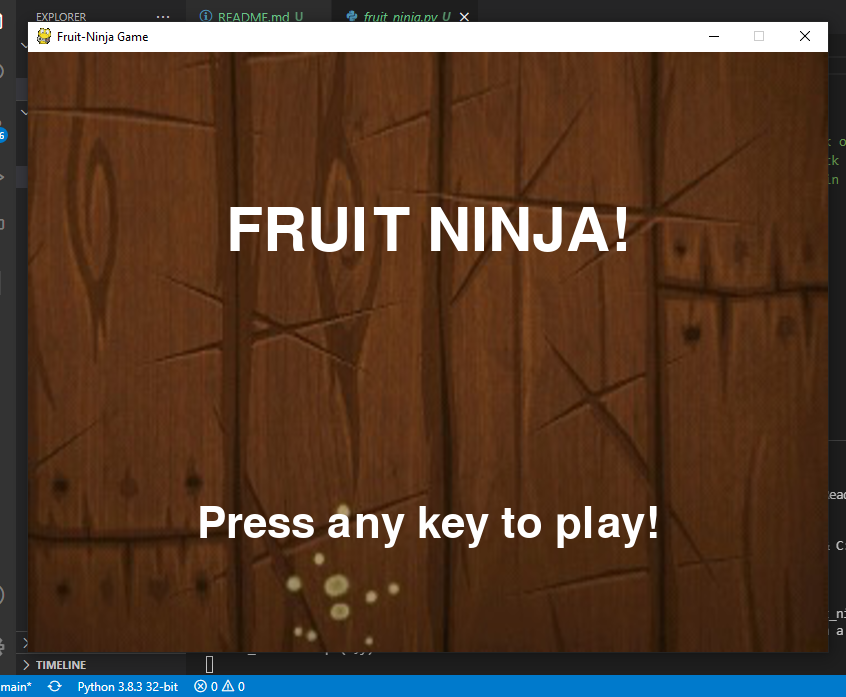
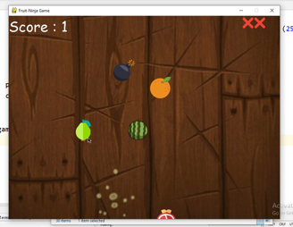
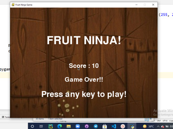

## FRUIT NINJA GAME 🍉💥

# DESCRIPTION

This is a fruit ninja fun game designed using pygame, player has to slice the fruits and get scores but beware of bombs!!💣💥

## Aim & Purpose

This game is designed using pygame to apply the concept of random module and it is designed for entertainment purpose.

## Detailed Explaination Of Script

The player has to just run the program press any key on the keyboard and get ready to play the very popular game Fruit Ninja 🍐🍉. Player has to slice the fruits which will be randomly shown on the screen and there would be three lives with the person. As soon as, the lives are finished the game will stop and Game Over screen will splash.

The user has to slice the fruits simply by moving their mouse cursor over the fruits 🍉 and just be aware of bombs 💣 because if the cursor is over the bomb then it will explode 💥 and player will loose one life. The user can see the fruits sliced in two parts when they move cursor over it.

On the game screen in the top left corner you could see your scrore and on the top right corner you can see your remaining lives ❌❌❌. At maximum you will get 3 lives so use them safely. If the player loses all three lives then a screen will splash and you can see a message of game over. You can even replay by pressing any key on the keyboard.

## SCREENSHOTS:

First Screen 🍉💥

Game Screen 🍉💥❌

Game Over Screen ❌💥

Functioning

## AUTHOR:
KHUSHI SHARMA

