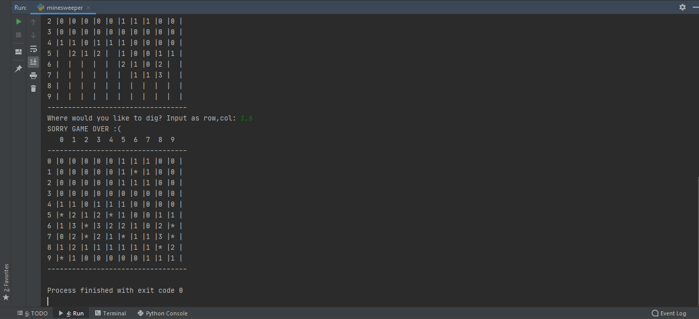
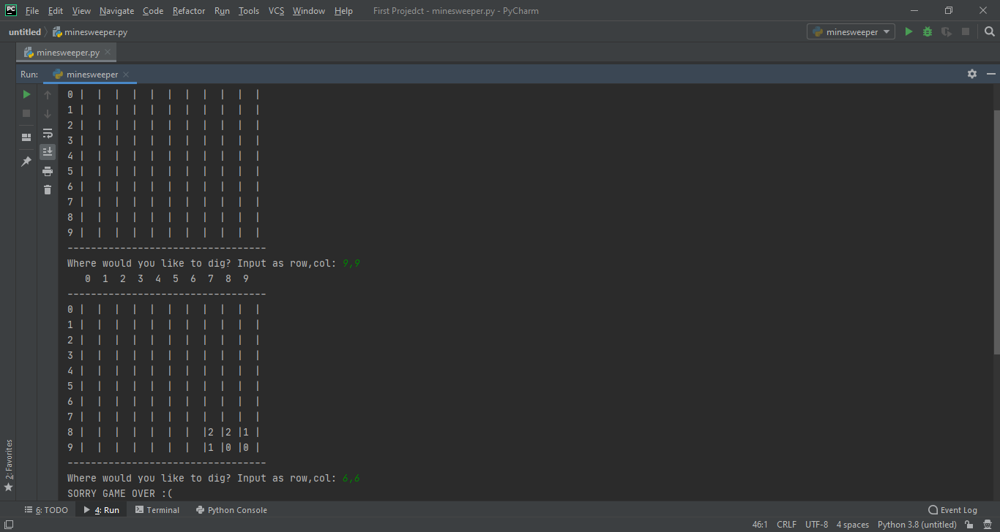

## Minesweeper Game 
- Minesweeper Game is a python program i.e, developed in python programming language using random module and some user inputs.

### About the game
- It's a basic python program which takes the random input as row and column, and iterate it over the game .

### How to play?
- Just run the program and enter any row and column .
- Step 1: create the board and plant the bombs
- Step 2: show the user the board and ask for where they want to dig
- Step 3a: if location is a bomb, show game over message
- Step 3b: if location is not a bomb, dig recursively until each square is at least next to a bomb
- Step 4: repeat steps 2 and 3a/b until there are no more places to dig -> VICTORY!

### Setup instructions
1. Install Python 3.x (recommended) from <a href="https://www.python.org/downloads/">here</a>
2. Download this repository as zip and extract.
3. Use Python IDLE or PyCharm to run the program.
4. Run the code and start taking input as Row and Column. 
5. Have fun!!

### Output

### Author👨‍
[Shubhankar Poddar](https://github.com/codeaholic-shub)
