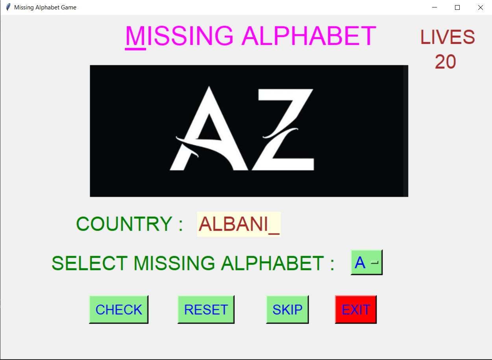
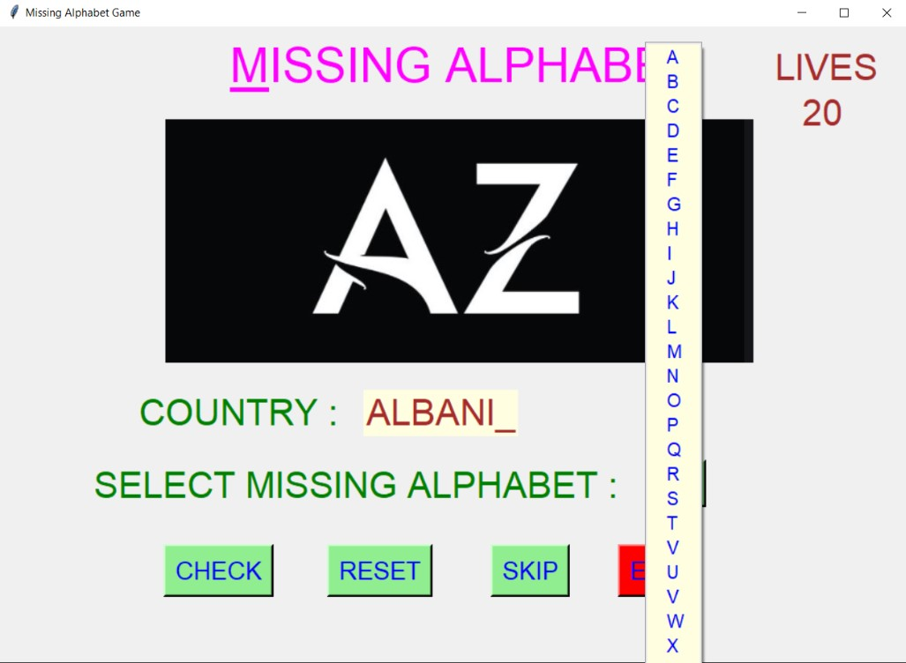
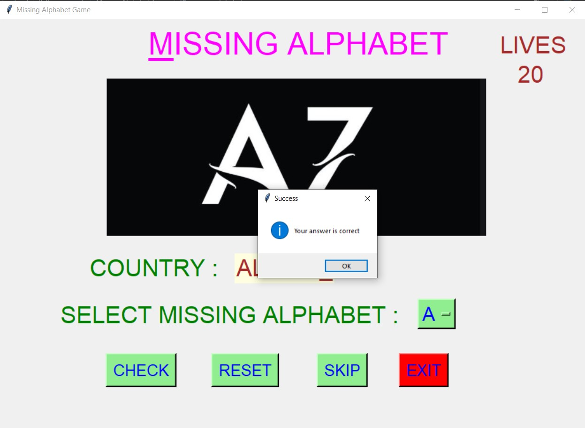
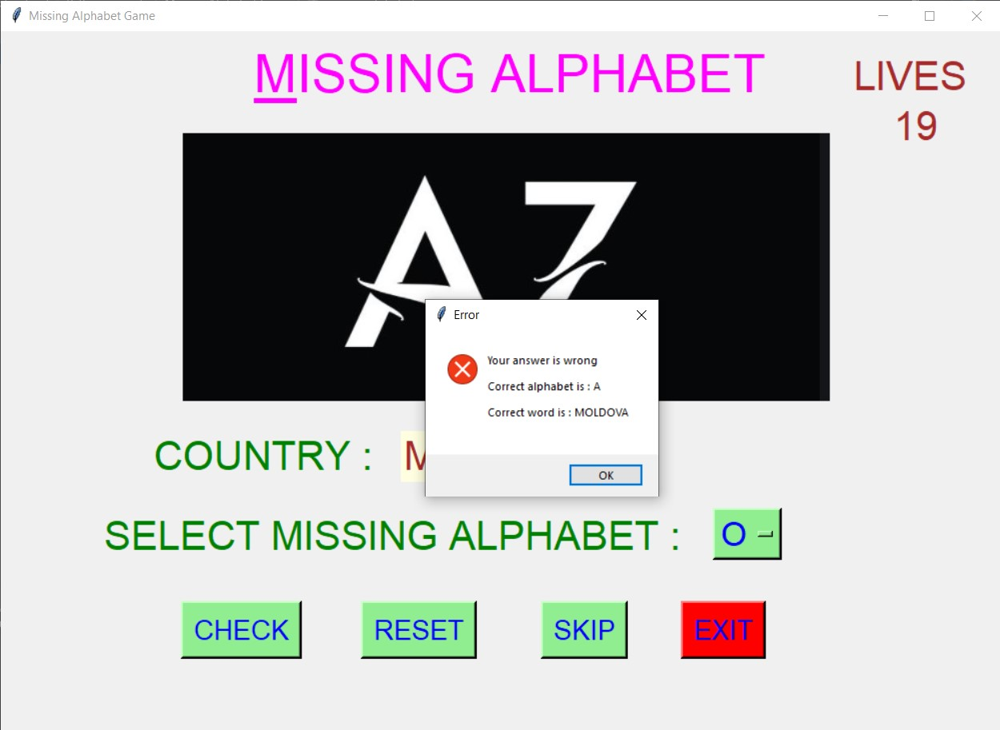
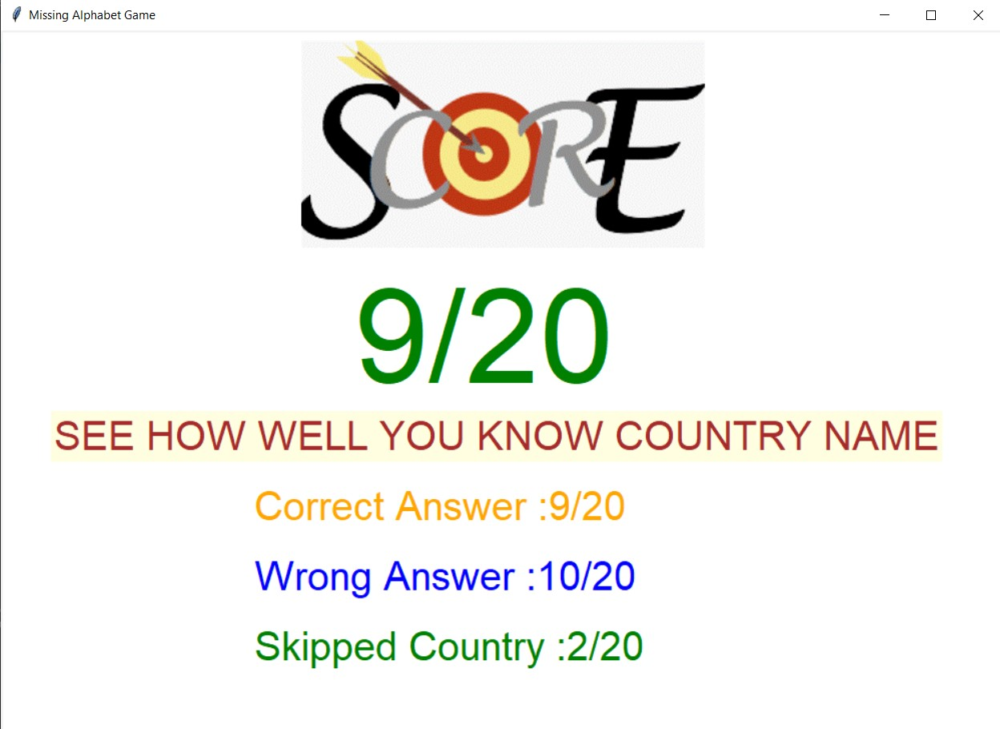
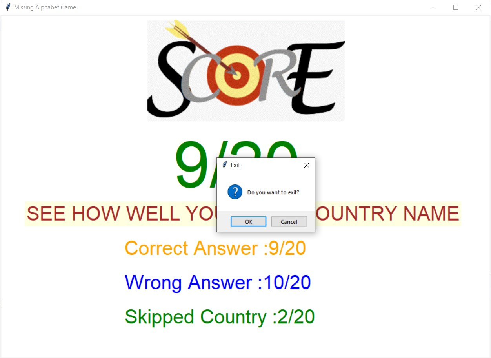

# ✔ MISSING ALPHABET GAME
- ### A Missing Alphabet Game created in python with tkinter gui.
- ### In this game, the user will get upto 20 counntry name with one alphabet missing, and he/she needs to enter the correct word for each country in just single chance.
- ### for the list of countries, used the country_name.csv dataset and read the data from there and used as the questions.

****

# REQUIREMENTS :
- ### python 3
- ### tkinter module
- ### from tkinter messagebox module
- ### PIL module
- ### random

****

# How this Script works :
- ### User just need to download the file and run the missing_alphabet_game.py on their local system.
- ### Now on the main window of the game the user will be a country name with one alphabet missing, and player need to select the missing alphabet from the drop down list of OptionMenu.
- ### After selecting the missing alphabet, when user click on check button, he will get the message whether his/her answer is correct or not.
- ### If answer is correct the score increases by 1 points and correct answer count increases by 1, else wrong answer count increases by 1.
- ### If the player skips the current country, then his skipped country count increases by 1.
- ### There is also only 20 Lives for player, and when the 20 lives are over the game will over.
- ### Also there is a reset button, clicking on which user can resets the Option Menu to default alphabet 'A'.
- ### Also there is an exit button, clicking on which exit dialog box appears asking for the permission of the user for closing the window.
- ### Also there is a skip button, clicking on which player can skip that particular country.
- ### At last when game overs, we are able to see the score in the new frame, showing the correct answer count, wrong answer count and skipped country count.

****

# SCREENSHOTS :

****

   
   
   
   
   
   
   

****
