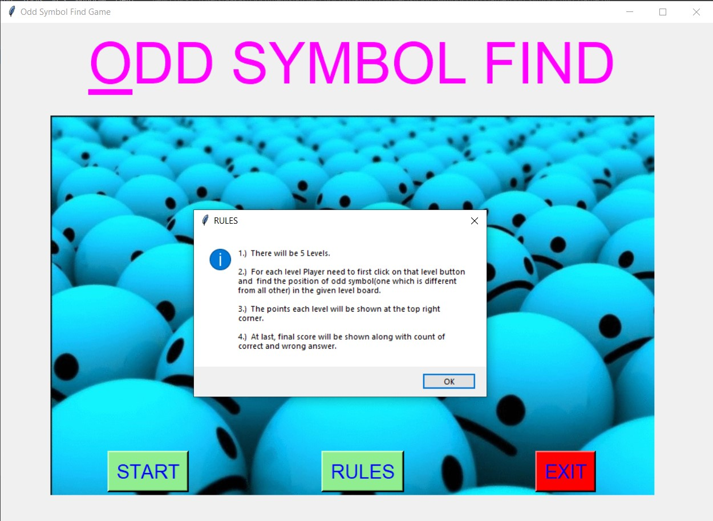
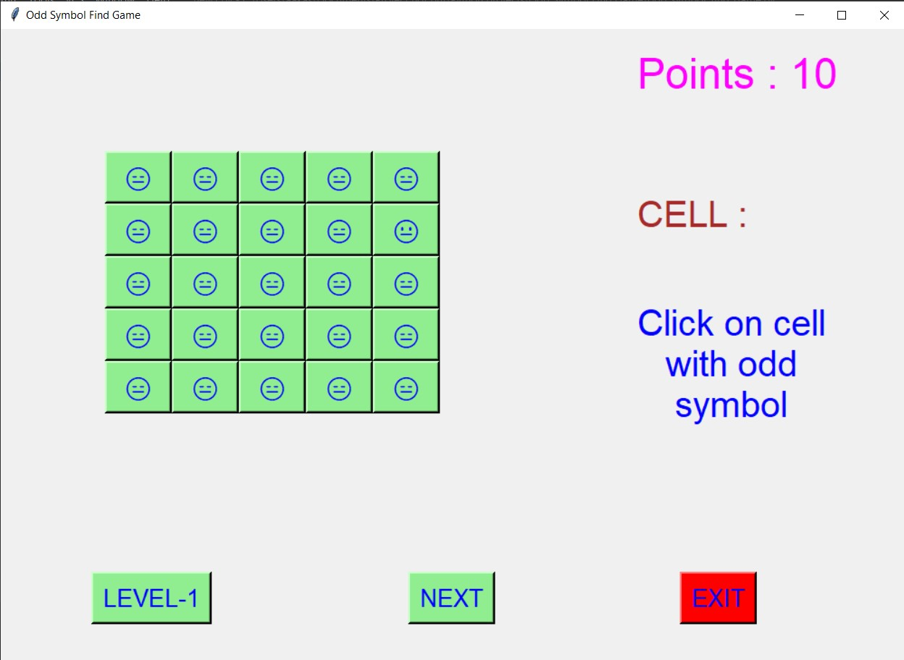
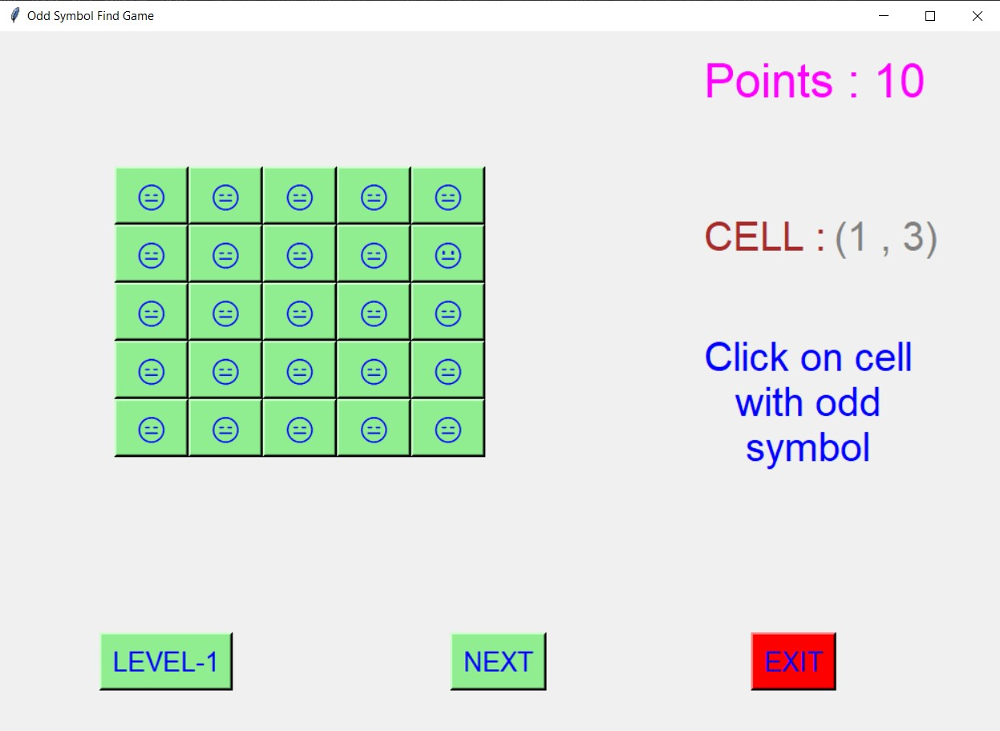
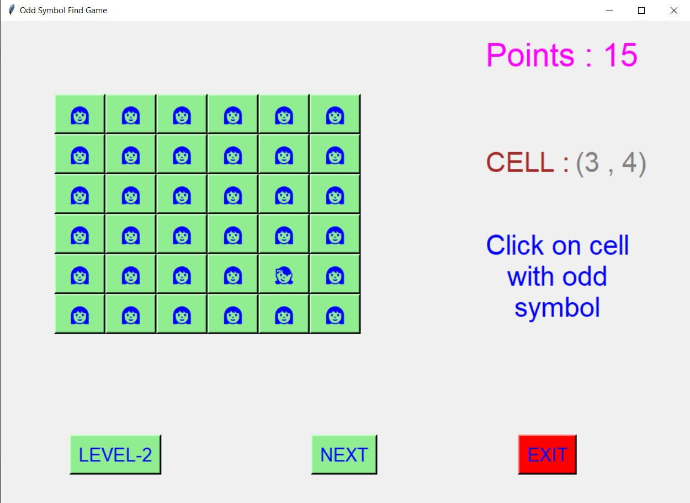
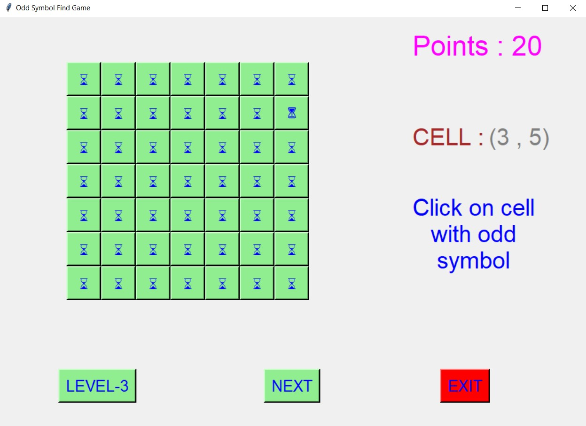
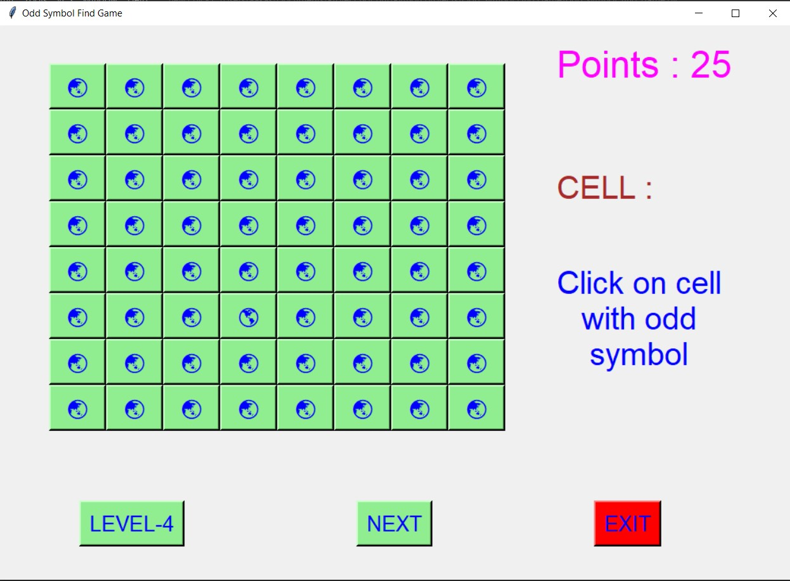
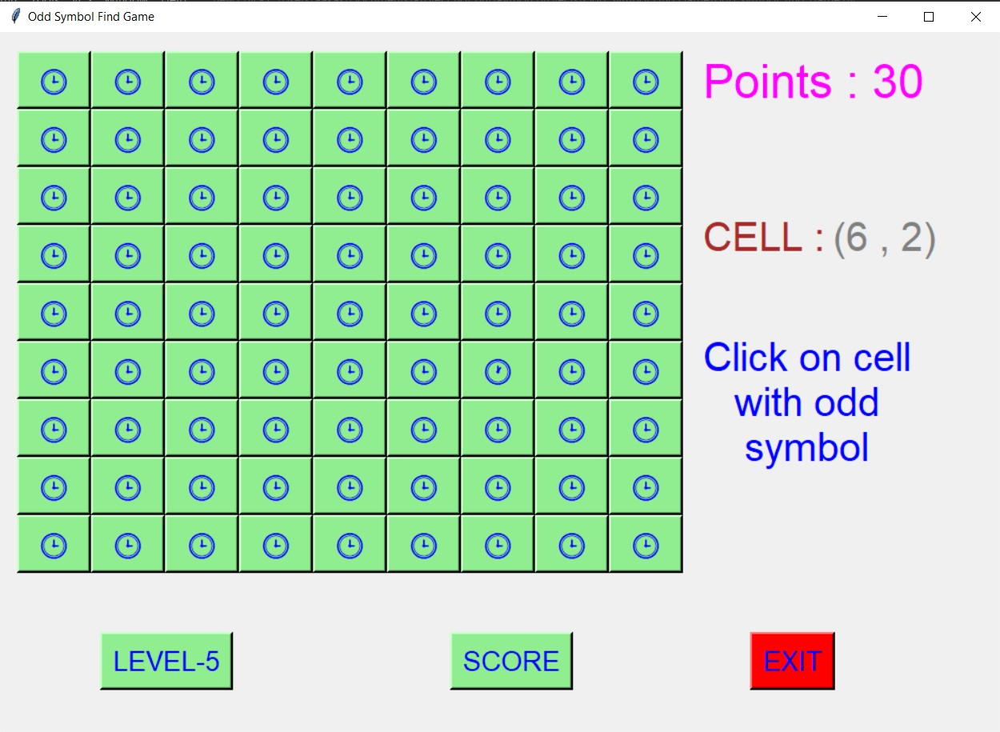
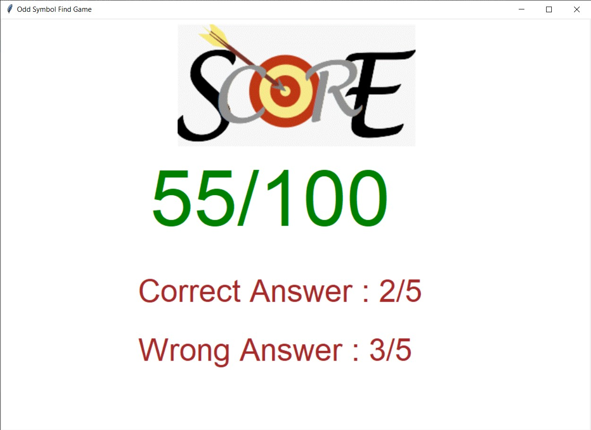
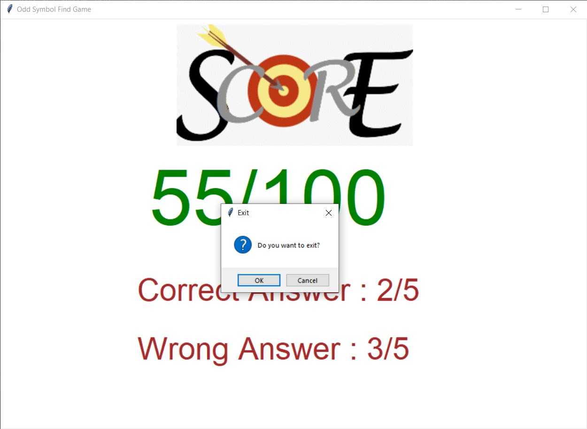

# ✔ ODD SYMBOL FIND GAME
- ### An "Odd Symbol Find Game" is a game created in python with tkinter gui.
- ### In this game player will be given 5 Levels.
- ### For each level Player need to first click on that level button and  find the position of odd symbol(one which is different from all other) in the given level board.
- ### The points each level will be shown at the top right corner.
- ### At last, final score will be shown along with count of correct and wrong answer.

****

# REQUIREMENTS :
- ### python 3
- ### tkinter module
- ### from tkinter messagebox module

****

# How this Script works :
- ### User just need to download the file and run the odd_symbol_find_game.py on their local system.
- ### Now on the main window of the game, the player can see start playing the game using START button.
- ### Before starting player should see the rules for this game by clicking on RULES button.
- ### And after that player can start playing and see the score at the last.
- ### Also there is an exit button, clicking on which exit dialog box appears asking for the permission of the user for closing the window.

# Purpose :
- ### The basic purpose of this game is to check how good is the eyesight of the player, as it is game of finding odd ones from bunch of symbols.

# Compilation Steps :
- ### Install tkinter, pandas
- ### After that download the code file, and run odd_symbol_find_game.py  on local system.
- ### Then the game will start running and you can play the game and watch the final score at last.

# SCREENSHOTS :

****

   
   
   
   
   
   
   
   
   
   

****

# Below is link to video of how game is to be played :

   

