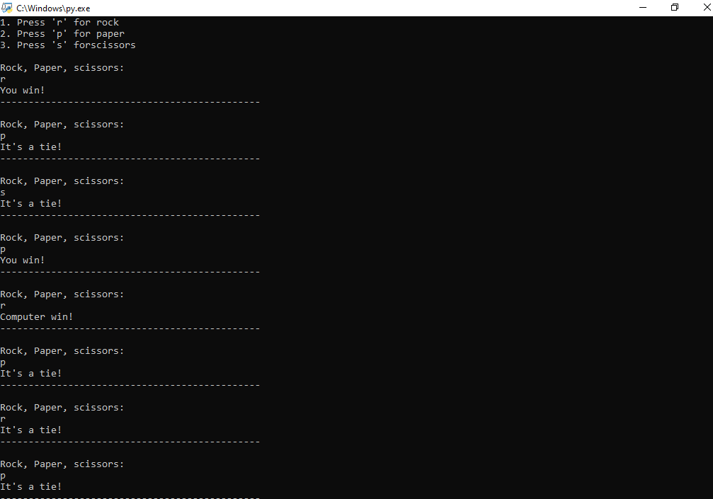
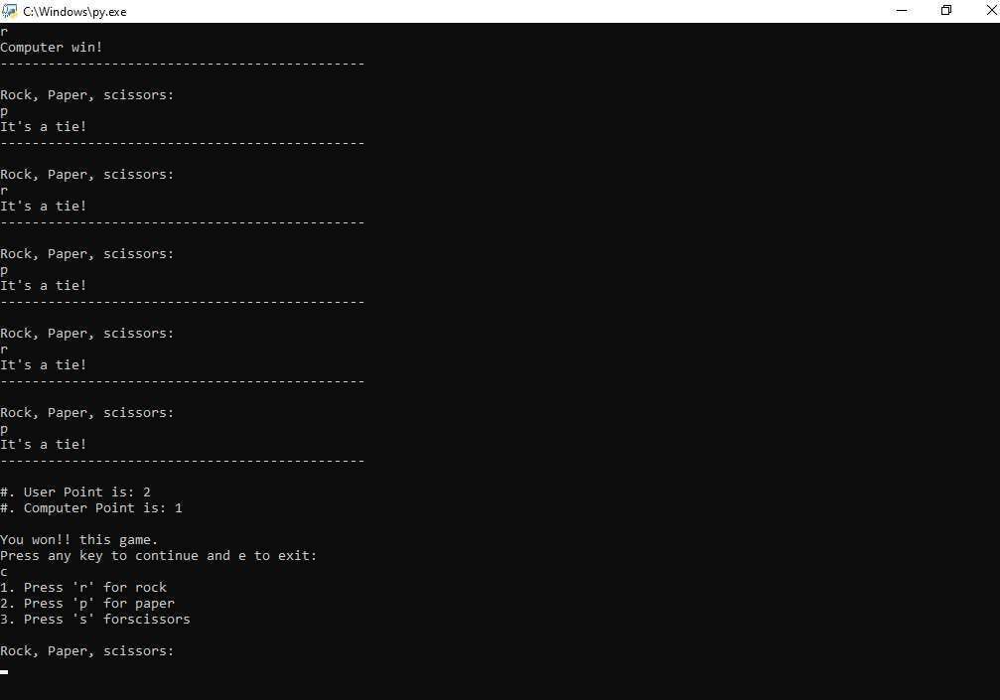

# Rock Paper Scissor Game
### About the Game :-
- It is a game which we all had played in our childhood.
- It is terminal based game.
- It is single player only i.e. you play with computer.

### How to play?
- You get 10 chances.
- Type **r** to choose **Rock**, **p** to choose **Paper**, **s** to choose **Scissor**.
- After game end whomever score is high will win the game.

### Requirements
- Your computer should have Python 3.
- If your computer don't have Python you can download it from google.

### Screenshot of the game

