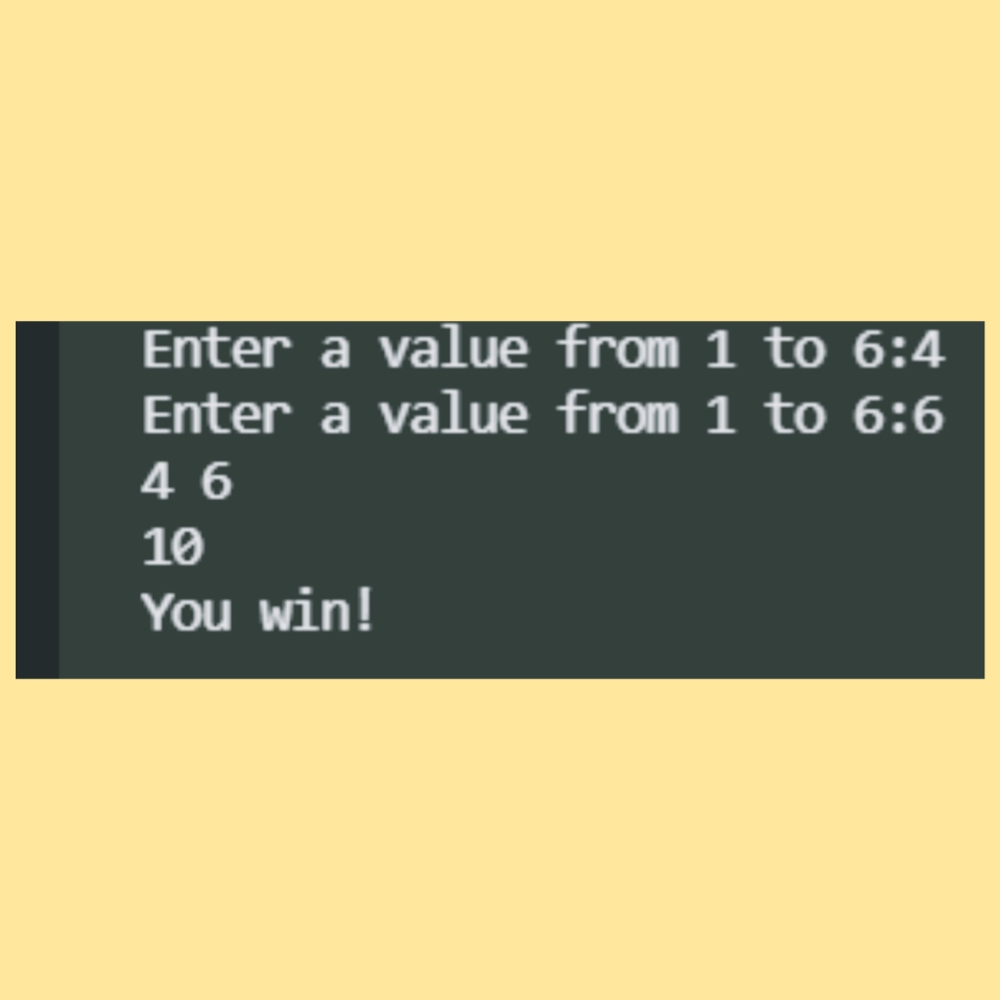
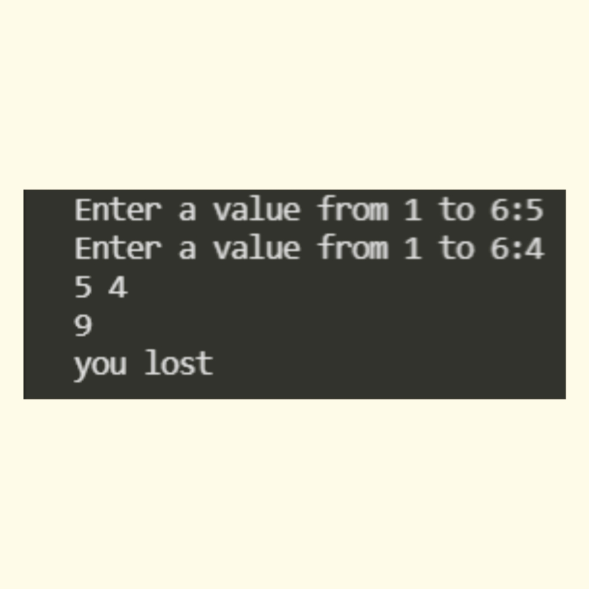

## Rolling a dice
Rolling dice  Game is a python program i.e, developed in python programming language using random module and some user inputs.

### About the game
- It's a basic python program which asks the user to enter a number from 1 to 6.The user have to enter the number twice.If sum of the numbers is divisible by 2 then the user will win the game else will lost the game..

### How to play?
- Enter a number from 1 to 6.
-Again it asks the user to enter a number.
-It then prints the numbers.
-If the sum of two numbers entered is even then the user will win.
-If the sum is odd then the uer will lose the game. 

### Requirements
- Your computer should have Python 3.
- If your computer don't have Python you can download it from google.
- Run the code.
-Have fun!

### Screenshot of the game

## Author
Dhara Bindal
username:bindaldhara

