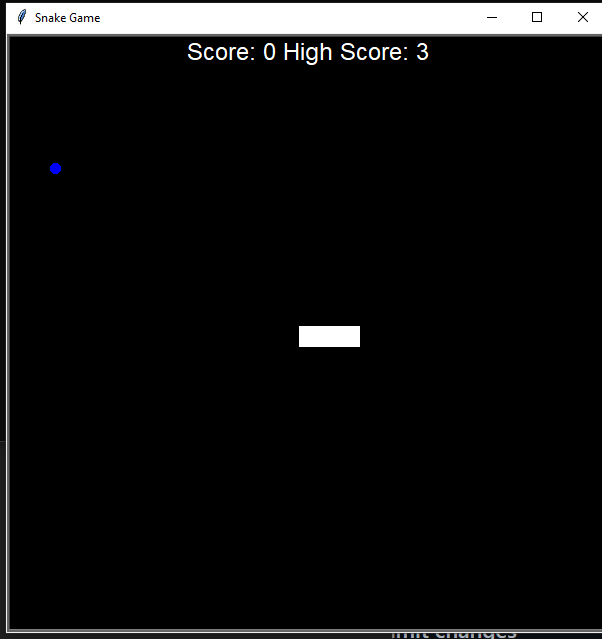

# Title: Snake_game_Enhanced

## Short description of package/script

- We can play the snake game and we also store our highest score.

## Setup instructions

We just need to run our project and click on up arrow button from keyboard as it will move upward , to move ther snake downward we have to click  down arrow button key and to make it move left left arrow key key and for right right arrow key and there you go.

## Libraries Imported

Libraries used in this project is Random, Turtle, Time.

## what's new update version
Create different file for each class. Increase readiability and also store higest score for future reference.

## Author(s) 

Alex Advent

##Screenshots

