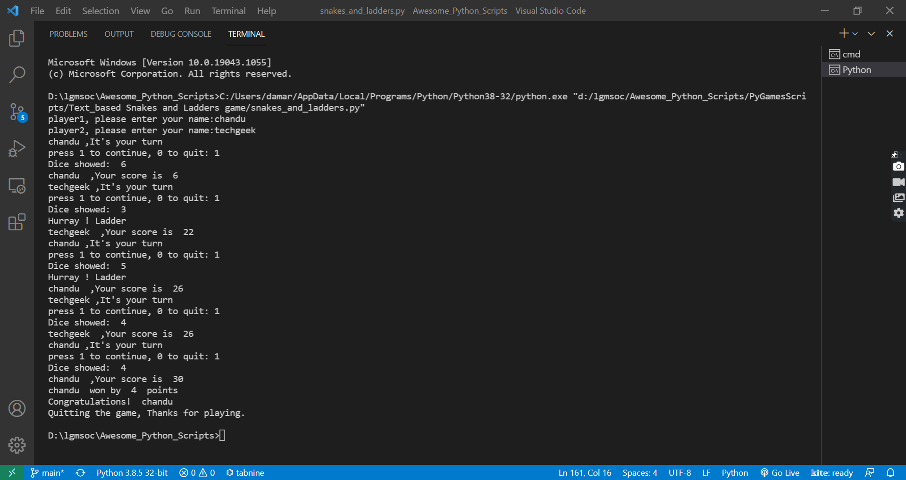

## Text_based Snakes and Ladders Game

- Playing snakes and ladders game is always fascinating, isn't it? This article explains you how to write a program in python in order to play the snakes and ladders game with your peers virtually.

### About the game

- It is a two-player game.
- The program will ask both the players for inputting their names.
- It randomly throws a dice and the number will be displayed.
- The number displayed should be added to the total score of players respectively.
- This continues until the end of the board is reached(until the maximum available score on the board is achieved by either of the players) or until either of them wishes to quit the game.

### How to play?

- Step 1:

Importing required libraries.

- Step 2:

Defining displayBoard() function, which is used for displaying the snakes and ladders board to the players of the game, to predict what number they should get in order to win.

- Step 3:

Defining the play() function where our actual game logic exists. The checkLadder(), checkSnake() and reachedEnd() functions used in this step will be used in upcoming steps-4,5,6.

- Step 4:

Here we are defining the checkLadder() function, (this function is written with respect to the snake and ladder board shown above). It checks the positions where a ladder is present and if the player reaches the points where there are ladders, the respective scores are incremented, updated and returned, else the scores are returned as usual.

- Step 5:

Defining checkSnake() function, (this function is written with respect to the snake and ladder board shown above). It checks the positions where a snake is present and if the player reaches the points where there are snakes, the respective scores are decremented, updated and returned, else the scores are returned as usual.

- Step 6:

Defining reachedEnd() function, which returns true if the score of any player has become equal to the maximum score on the board(end = 30 on the above board).

- Step 7:

Finally, calling the displayBoard() and play() functions.

Yeah, we developed the game successfully!

### Setup instructions

1. Install Python 3.x (recommended) from <a href="https://www.python.org/downloads/">here</a>
2. Download this repository as zip and extract.
3. Use Python IDLE or PyCharm to run the program.
4. Run the code and start taking input as Row and Column. 
5. Have fun!!

### Screenshot of the game (Output)

### Author

[Damarla Venkata Sai Chandana](https://github.com/chandu6111)
