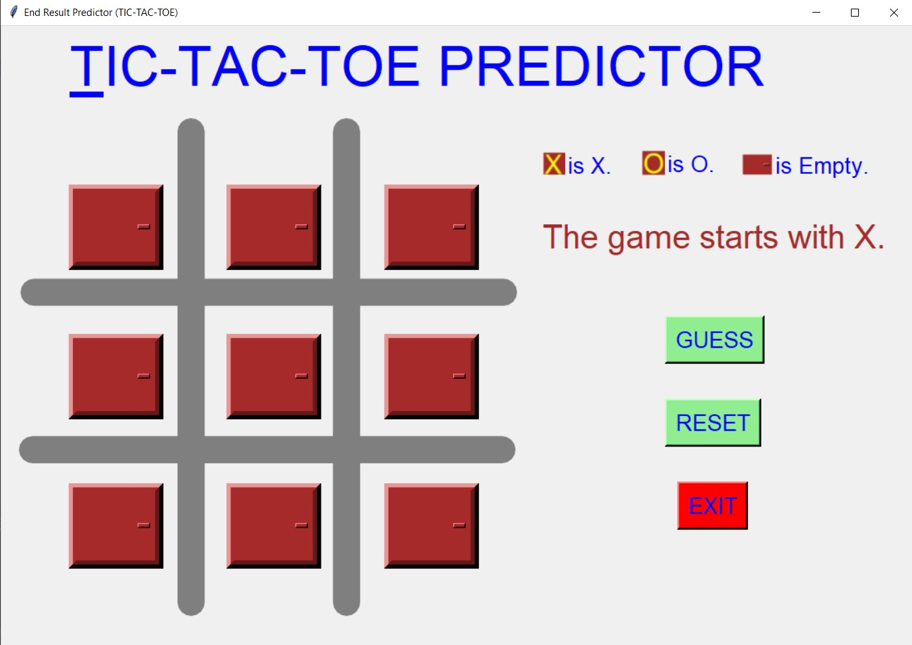
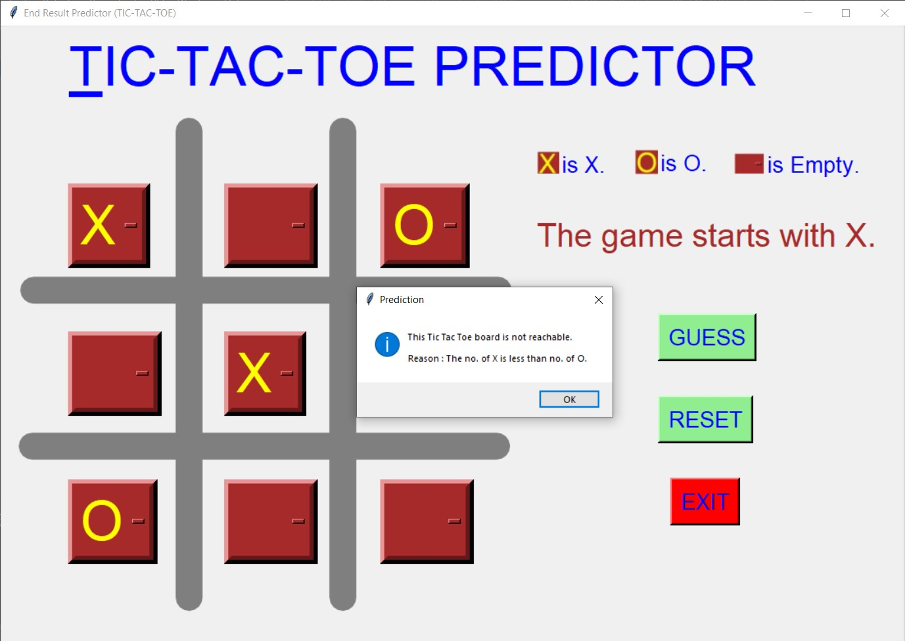
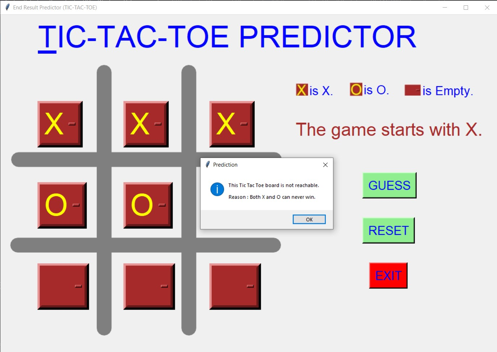
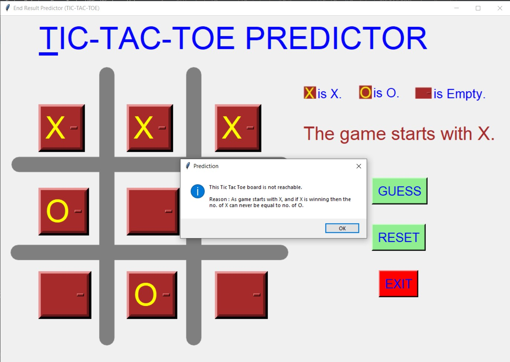
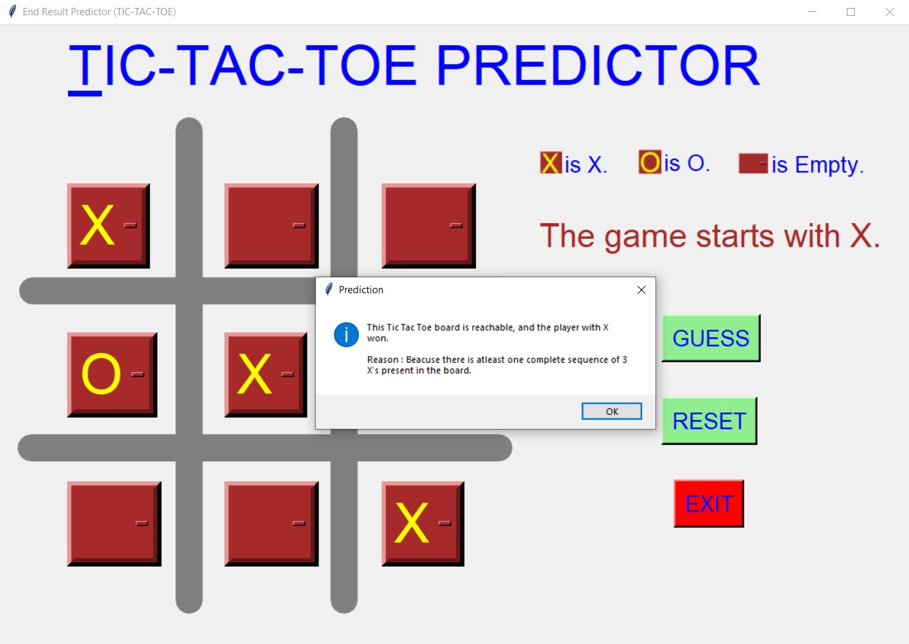
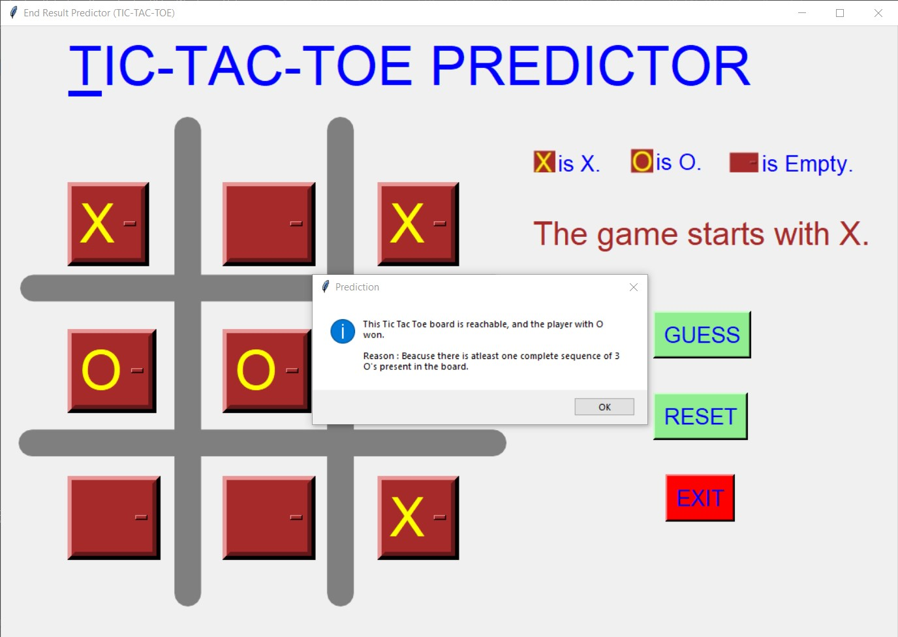
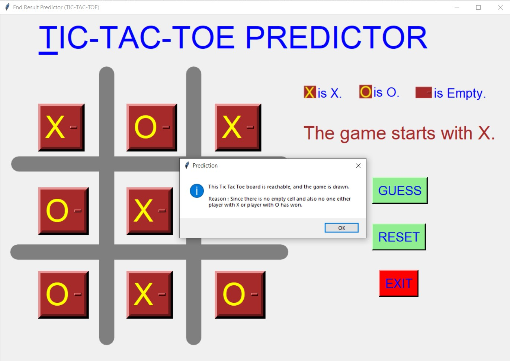
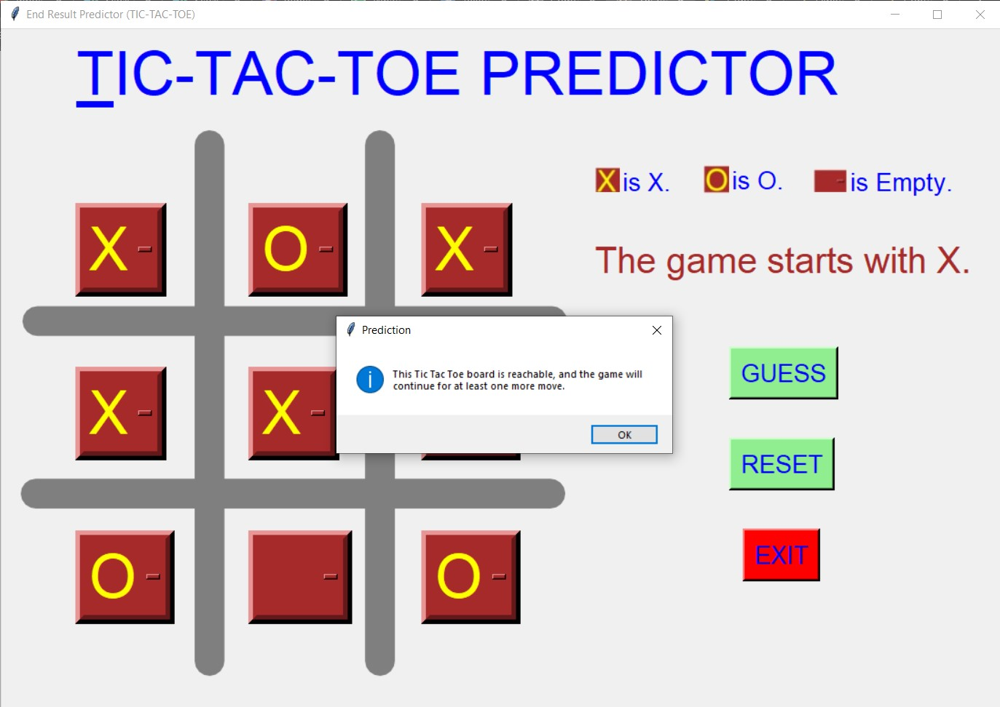

# ✔ TIC TAC TOE - End Result Predictor 
- ### A script created with tkinter GUI.
- ### This script predicts the end result of the TIC TAC TOE board given as input by the user.

****

# REQUIREMENTS :
- ### python 3
- ### tkinter module
- ### from tkinter messagebox module
- ### PIL module

****

# How this Script works :
- ### User just need to download the file and run the end_result_predictor.py on their local system.
- ### Now on the main window of the game the user will be given a TIC TAC TOE board with all the cell blank initially.
- ### Now here user can fill the TIC TAC TOE board with his/her choice, and click on the guess button.
- ### By clicking on the guess button the user will get a message showing what will happen when the input TIC TAC TOE board is considered as the intermediate step.
- ### The guess button will consider all the possible cases in TIC TAC TOE game, like 1.) is the board inputed by user is reachable in real life TIC TAC TOE game? 2.) is player with X or O will win? 3.) is the game is going to be drawn from this stage 4.) or the game will go further for more than one turns.
- ### Also there is a reset button, clicking on which user can resets the Option Menu of all the cells to default empty cell.
- ### Also there is an exit button, clicking on which exit dialog box appears asking for the permission of the user for closing the window.

****

# SCREENSHOTS :

****

   
   
   
   
   
   
   
   
   
   
   

****

# Sample video link :
https://user-images.githubusercontent.com/57003737/122680275-f9104b80-d20b-11eb-9b08-fa5e9e3e96e1.mp4