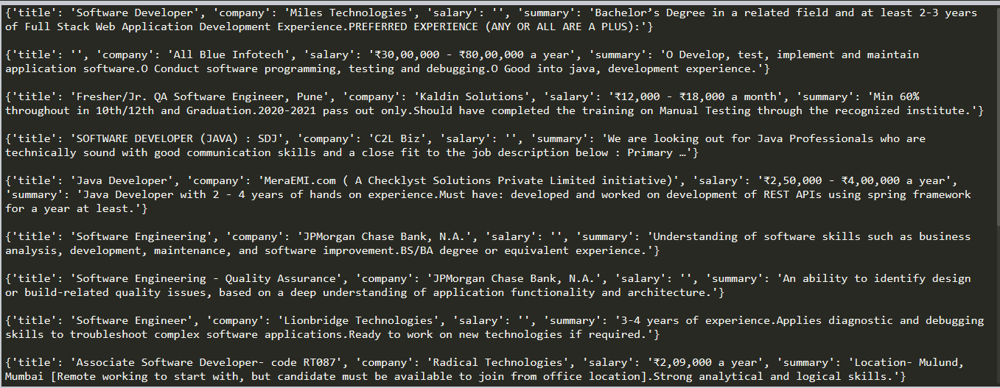

# Job Search Tool

### Description:

This program fetches the details such as the job role, company name and summary of jobs in software development field in India.

### Libraries used:

- bs4
- requests

### Setup Instructions:

1. Install the libraries bs4 and requests.
1. Run the program
1. The output is displayed in the terminal.

### Output:

### Author:

Sonali Bedade
