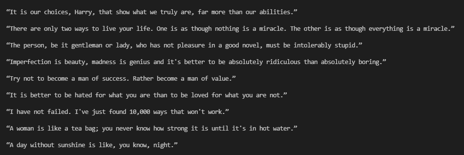
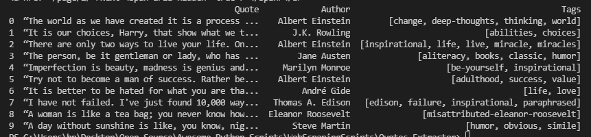

# **Quotes Extractor**

## **Aim**

Extracting famous quotes of different personalities.

## **Purpose**

A step by step guide to understand Web Scrpaing by extracting the quotes of many famous personalities available at [quotes.toscrape.com](https://quotes.toscrape.com/) and storing that data into the CSV file which can be later used for further Analysis.

## **Short description of package/script**

Libraries used in this project are:<br>
 - ```pandas```: To Store the data in DataFrame and later converting it to CSV file.<br>
 - ```bs4```: To import BeautifulSoup in order to extract elements from the Website.<br>
 - ```requests```: To send and get request from the website in order to scrape its data.


## **Workflow of the Project**

 - Importing relevant Libraries.
 - Extracting different basic elements and their texts from the website like title, author names and some quotes.
 - Extracting the data from multiple pages using ```while``` loop.
 - Creating a dataframe from the extracted data.
 - Storing the data in a CSV file.

## **Setup instructions**

In order to run this program, make sure that you have all the required libraries installed, use the following commands for installation:<br>
 - ```pip install pandas```<br>
 - ```pip install beautifulsoup4```
 - ```pip install requests```<br>

Also you should be having a browser like Mozilla Firefox, where you can inspect the website by ```Right Click -> Inspect```

## **Output**

#### **Authors:**


#### **Quotes:**


#### **DataFrame:**


## **Author(s)**

Gaurav Kumar
