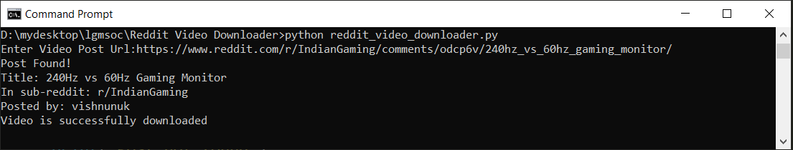

# Reddit Video Downloader

### Description:

This is a python script which will download the video of the post in reddit by asking user url of page of the post and also display post title,
subreddit and author name on the console. The video is stored in our local system as download.mp4
### Libraries used:

- requests

### Aim:

To download videos from the reddit posts. 

### Purpose: 

In reddit, there is no option to download videos which people 
post on their account posts. So this script helps to download those videos. 
We just want to copy the url of the video on reddit. . 

### Workflow:

Import json and get & except module from requests libraries in the Python file that you are going to use to get the reddit post information and video.
Using get we can request data from the url and extract its json data and except is used to provide exceptions.
Now we can easily get the information and links about the post and the video from that web page using json data and display it in our console. 
Then we will create a file download.mp4 and store the video in this file. 

### Setup Instructions:

1. Install the requests.
2. Run the program
3. The output is displayed in the terminal.

### Output:

### Author:

Akash Jain
