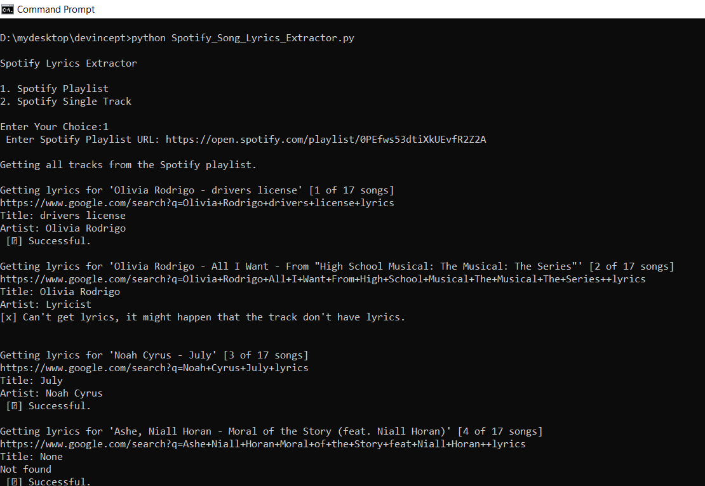

# Spotify Song Lyrics Extractor

### Aim:

To extract lyrics of all spotify songs from a single track or from a playlist. 

### Description:

This is a python script which will ask user 2 options:

* Spotify Single Track 
* Spotify Playlist 

If user choose Spotify Single Track then user have to provide name of a spotify song/track 
and then it will scrape lyrics of that song from Google and save the lyrics in 
song_name.txt file in the Lyrics folder and also display song title and artist name in the console. 

If user chooses Spotify Playlist then user have to give link of the spotify playlist and first 
it will scrape all tracks/songs and then try to find lyrics of all that songs and save the lyrics 
of each song as particular song_name.txt file in the Lyrics folder respectively for each song and display 
title and artist name for each song in the playlist in the console. 

### Libraries used:

- requests
- beautifulsoup4
- spotipy

### Setup Instructions:

1. Install requirements from requirements.txt.
2. Run the program
3. The processing of output is displayed in the terminal.
4. You can access the lyrics for each song in the Lyrics folder. 

### Output:

### Author:

Akash Jain
