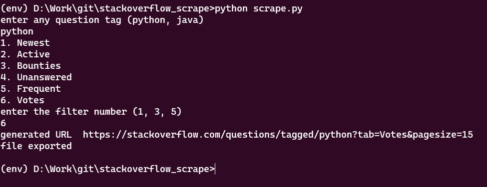
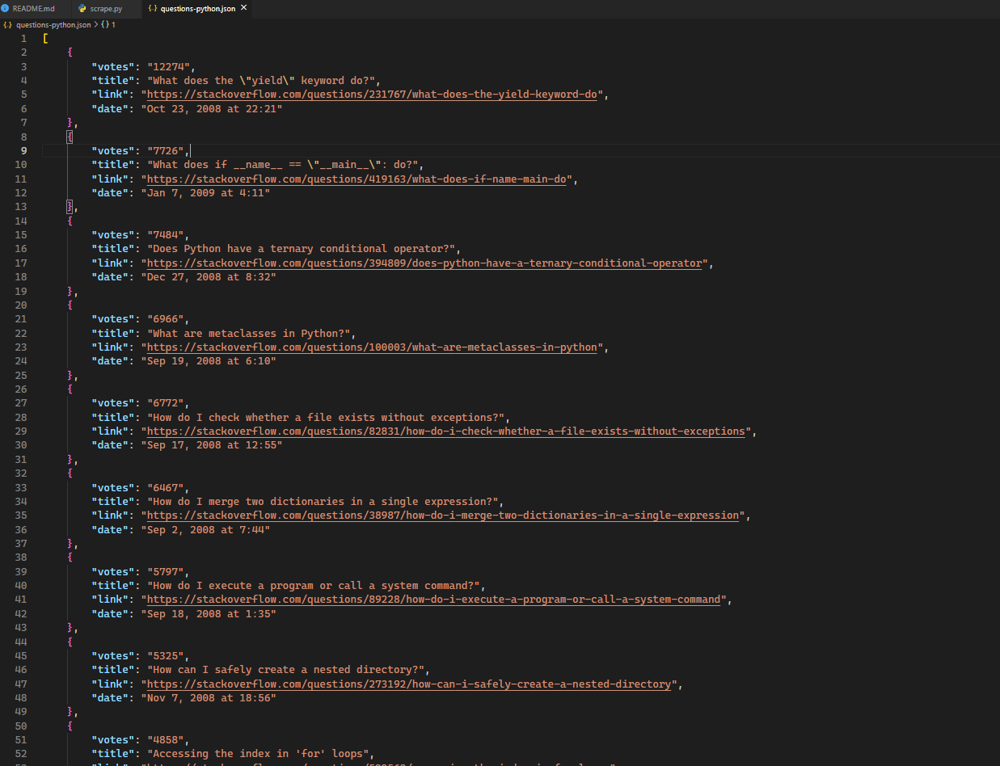

# StackOverflow Question Scraper

## Aim

The main Aim of the project is to scrape 50 questions from StackOverflow and store it in a serialized format like a JSON file.

## Purpose

The purpose of the project is to provide a fast way in which a user can easily see the top questions based on the tag.

## Setup instructions

- The Script uses BeautifulSoup to scrape contents from the Website. 
- To avoid any version change run `pip install -r requirements.txt` in your terminal
- After installing the dependencies run `python scrape.py`
- Enter the tag you want to scrape and the filter and now you are good to go. 

## Output

   

## Author

[Vivek Kumar Singh](https://github.com/vivekthedev)
